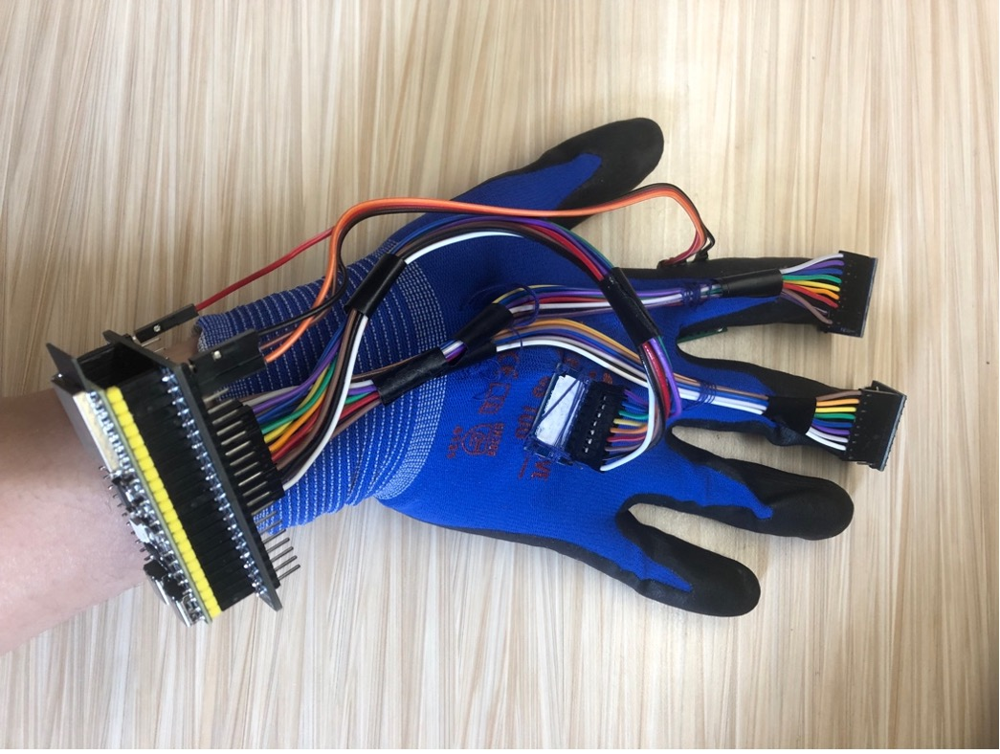
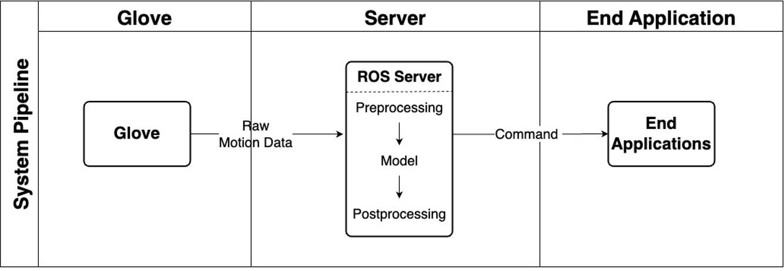
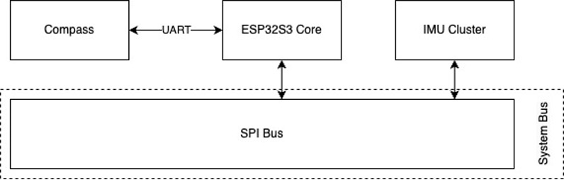
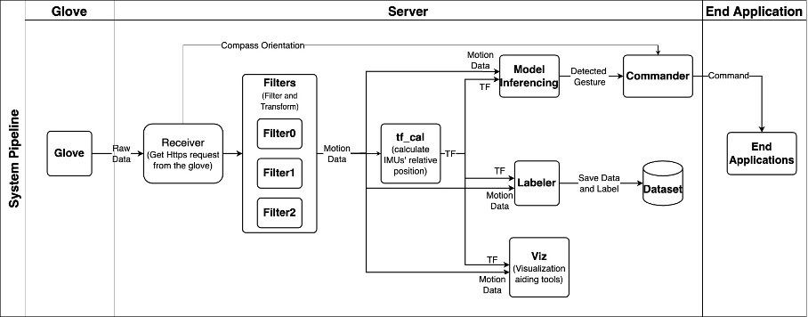

# FYP Control remote devices with air gestures

In this project, we develop a smart glove that can control electronic devices wirelessly. We have designed a physical smart glove embedded with sensors and wireless communication technologies. The data collected from the smart glove will be transmitted to a server that is capable of processing the sensor data and classifying these time-series data into pre-defined gestures with machine learning. These gestures can then be sent to applications and perform the task we intended with the gesture in an intuitive way. The project includes several applications to demonstrate the capabilities of the system, including control of PowerPoint and LED control using gestures received.

## System Architecture

The smart glove collects motion data and orientation information from the user's hand. This data is then transmitted to a ROS (Robot Operating System) server via a Wi-Fi connection. The ROS server processes the received data by applying filtering and transformation techniques to obtain preprocessed motion data. The preprocessed data is then fed into a trained gesture recognition model for real-time inference. The decision module analyzes the detected gesture and combines it with the orientation information from the glove to determine the appropriate command to be sent to the target devices.

The end application devices receive the command from the ROS server and respond accordingly. These application devices can include PowerPoint software, light bulbs, or any other compatible devices. The overall system allows users to control devices wirelessly by performing intuitive air gestures.

## The Hardware Design of the Smart Glove
Our implementation features a normal glove equipped with three IMUs located on the index finger, middle finger, and back of the palm. A microcontroller unit (MCU), an ESP32-S3, is positioned on the back of the hand, and is equipped with both WI-FI and Bluetooth connectivity, allowing communication with the server. The three IMUs (MPU9250) are connected to the ESP32-S3 through four data lines and two power lines, following the Serial Peripheral Interface (SPI) protocol which enables access to multiple slave devices of the same type on the data bus. Moreover, a compass (GY26) is connected to ESP32-S3 through two data lines and two power lines, following the Universal Asynchronous Receiver/Transmitter (UART) protocol. To power the ESP32-S3, we use a power bank.

## The Server Design
The raw data received on the server side is in a JSON string and processed using the ROS2 framework. Firstly, a receiver node will establish a Flask server for receiving the JSON string, then, the data is transformed into local data with reference to the palm and used by different backend nodes for tasks such as filtering and transform calculation. Then, the model predicts gesture class based on the preprocessed input data. Finally, the commander node will get the output from the gesture recognition model and send the commands dedicated to the devices based on the orientation received from the receiver module.

## Submodules
This project consists of two main submodules:

1. FYP-Glove: This submodule handles the communication between the glove and the server. It includes the IMU driver and compass functionalities, ensuring the accurate collection and transmission of motion data.

2. FYP-Server: This submodule contains the server implementation for the FYP pipeline. It includes the receiver, backend processing, gesture recognition, and command generation modules.

## Demo
A demo video showcasing the functionality of the project can be found at the following link: https://cse.hkust.edu.hk/ug/fyp/posters/gallery/2022-2023/96_CSB1_Media.mp4